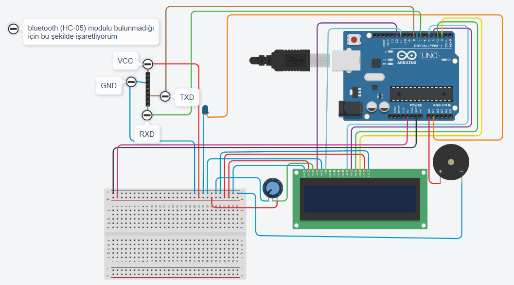

# 🚨 AI-Powered Distance Alert System
### Yapay Zeka Destekli Çarpışma Önleme ve Mesafe Uyarı Sistemi

<div align="center">


</div>

## 📖 Proje Hakkında

Bu proje, **YOLOv8** yapay zeka modeli kullanarak gerçek zamanlı insan tespiti yapan ve kişilere olan mesafeyi hesaplayarak çarpışma riski oluşmadan önce uyarı veren bir güvenlik sistemidir.

Sistem, bir kamera aracılığıyla çevreyi izler, yaklaşan kişileri tespit eder ve mesafeye göre üç seviyeli bir alarm sistemi ile kullanıcıyı uyarır:

- 🔴 **Tehlike Bölgesi (0-100 cm)**: Sesli ve görsel alarm
- 🟡 **Dikkat Bölgesi (100-200 cm)**: Görsel uyarı
- 🟢 **Güvenli Bölge (200+ cm)**: Normal durum

---

## 🎯 Kullanım Alanları

| Alan | Açıklama |
|------|----------|
| 🦯 **Görme Engelli Bireylere Yardımcı Teknoloji** | Çevredeki insanları algılayarak sesli uyarı verir |
| 🚗 **Otonom Araçlar** | Park sensörü ve yaya tespiti |
| 🤖 **Robotik Sistemler** | Çevre farkındalığı ve engel algılama |
| 🔐 **Güvenlik Sistemleri** | Kısıtlı alanlara yetkisiz giriş tespiti |
| 😷 **Sosyal Mesafe Takibi** | Pandemi döneminde mesafe kontrolü |
| 🏭 **Endüstriyel Güvenlik** | İş makinelerinde operatör güvenliği |

---

## ⚙️ Sistem Özellikleri

- ✅ **Gerçek Zamanlı AI Tespiti**: YOLOv8 ile ~30 FPS hızında insan algılama
- ✅ **Mesafe Hesaplama**: Kamera tabanlı görüntü işleme ile 30-300 cm arası ölçüm
- ✅ **Kablosuz İletişim**: Bluetooth üzerinden Arduino ile veri aktarımı
- ✅ **Üç Seviyeli Alarm**: Mesafeye göre kademeli uyarı sistemi
- ✅ **LCD Ekran**: Anlık mesafe ve durum göstergesi
- ✅ **Sesli Uyarı**: Buzzer ile kritik mesafelerde alarm
- ✅ **Görsel Uyarı**: LED ile durum gösterimi
- ✅ **Canlı Görüntüleme**: Bilgisayar ekranında tespit sonuçları
- ✅ **Düşük Güç Tüketimi**: Powerbank ile taşınabilir kullanım

---

## 🛠️ Gerekli Donanım Bileşenleri

| # | Bileşen Adı | Adet | Açıklama |
|---|-------------|------|----------|
| 1 | Arduino Uno R3 | 1 | Mikrodenetleyici (ATmega328P) |
| 2 | HC-05 Bluetooth Modülü | 1 | Kablosuz seri iletişim |
| 3 | LCD Ekran 16x2 | 1 | Karakter tabanlı görüntüleme ekranı |
| 4 | USB Web Kamera | 1 | Görüntü yakalama (En az 720p önerilir) |
| 5 | Buzzer (Piezo) | 1 | Pasif veya aktif buzzer (5V) |
| 6 | LED | 1 | 5mm LED - Herhangi bir renk |
| 7 | Potansiyometre | 1 | 10kΩ - LCD kontrast ayarı için |
| 8 | Breadboard | 1 | Full+ veya 830 pin |
| 9 | Jumper Kablolar | 20-25 | Erkek-Erkek bağlantı kabloları |
| 10 | Powerbank | 1 | 5V/2A çıkışlı |
| 11 | USB Kablosu | 1 | Arduino bağlantısı için (Tip A - Tip B) |

---

## 💻 Yazılım Gereksinimleri

### İşletim Sistemi
- Windows 10/11, Linux, macOS

### Yazılımlar
- 🐍 **Python**: 3.8 veya üzeri
- 🔧 **Arduino IDE**: 1.8.19 veya üzeri

### Python Kütüphaneleri
```bash
opencv-python
ultralytics
pyserial
```

---

## 🔌 Devre Bağlantı Şeması



### Detaylı Bağlantı Tablosu

#### 1. LCD Ekran 16x2 Bağlantıları

| LCD Pin No | Pin İsmi | Arduino Bağlantısı | Açıklama |
|------------|----------|-------------------|----------|
| 1 | VSS | GND (Breadboard) | Topraklama |
| 2 | VDD | 5V (Breadboard) | Güç girişi |
| 3 | V0 | Potansiyometre Orta Uç | Kontrast ayarı |
| 4 | RS | Digital Pin 12 | Register Select |
| 5 | RW | GND (Breadboard) | Read/Write (Write modu) |
| 6 | E | Digital Pin 11 | Enable sinyali |
| 11 | D4 | Digital Pin 5 | Veri hattı 4 |
| 12 | D5 | Digital Pin 4 | Veri hattı 5 |
| 13 | D6 | Digital Pin 3 | Veri hattı 6 |
| 14 | D7 | Digital Pin 2 | Veri hattı 7 |
| 15 | A (LED+) | 5V (Breadboard) | Arka ışık pozitif |
| 16 | K (LED-) | GND (Breadboard) | Arka ışık negatif |

> **Not:** LCD 4-bit modunda çalışır (D0-D3 pinleri kullanılmaz).

#### 2. Potansiyometre Bağlantıları

| Potansiyometre Pin | Arduino Bağlantısı | Açıklama |
|-------------------|-------------------|----------|
| Sol Bacak (Pin 1) | GND (Breadboard) | Topraklama |
| Orta Bacak (Pin 2) | LCD Pin 3 (V0) | Kontrast çıkışı |
| Sağ Bacak (Pin 3) | 5V (Breadboard) | Güç girişi |

#### 3. HC-05 Bluetooth Modülü Bağlantıları

| HC-05 Pin | Arduino Bağlantısı | Açıklama |
|-----------|-------------------|----------|
| VCC | 5V (Breadboard) | Güç girişi (3.3V-6V) |
| GND | GND (Breadboard) | Topraklama |
| TXD | Digital Pin 8 (Arduino RX) | Veri gönderimi |
| RXD | Digital Pin 7 (Arduino TX) | Veri alımı |

> **Önemli Not:** HC-05'in TXD pini Arduino'nun RX pinine (D8), RXD pini ise Arduino'nun TX pinine (D7) bağlanmalıdır.

#### 4. Buzzer (Piezo) Bağlantıları

| Buzzer Pin | Arduino Bağlantısı | Açıklama |
|------------|-------------------|----------|
| + (Uzun Bacak) | Analog Pin A0 | Sinyal pini |
| - (Kısa Bacak) | GND (Breadboard) | Topraklama |

#### 5. LED Bağlantıları

| LED Pin | Arduino Bağlantısı | Açıklama |
|---------|-------------------|----------|
| + (Uzun Bacak/Anode) | Analog Pin A1 | Sinyal pini |
| - (Kısa Bacak/Cathode) | GND (Breadboard) | Topraklama |

> **Not:** İsteğe bağlı olarak LED'in ömrünü uzatmak için 220Ω'luk bir direnç eklenebilir.

### Arduino Pin Dağılımı Özeti

| Arduino Pin | Bağlı Bileşen | Fonksiyon |
|------------|--------------|-----------|
| 5V | Breadboard + Hattı | Güç kaynağı |
| GND | Breadboard - Hattı | Topraklama |
| D2 | LCD D7 | Veri |
| D3 | LCD D6 | Veri |
| D4 | LCD D5 | Veri |
| D5 | LCD D4 | Veri |
| D7 | Bluetooth RXD | Veri alımı (TX) |
| D8 | Bluetooth TXD | Veri gönderimi (RX) |
| D11 | LCD E | Enable |
| D12 | LCD RS | Register Select |
| A0 | Buzzer (+) | Ses çıkışı |
| A1 | LED (+) | Işık çıkışı |

---

## 🔧 Montaj Adımları

1. **Breadboard Hazırlığı**: Arduino 5V pinini breadboard'un (+) hattına, GND pinini ise (-) hattına bağlayarak güç hatlarını oluşturun.

2. **Potansiyometre Bağlantısı**: Potansiyometreyi breadboard'a yerleştirin ve güç, toprak ve çıkış pinlerini ilgili yerlere bağlayın.

3. **LCD Ekran Bağlantısı**: LCD'nin güç, kontrast, kontrol ve veri pinlerini şemaya uygun şekilde Arduino ve breadboard'a bağlayın.

4. **Bluetooth Modülü Bağlantısı**: HC-05 modülünün VCC, GND, TXD ve RXD pinlerini bağlayın.

5. **Buzzer Bağlantısı**: Buzzer'ın pozitif bacağını Arduino A0'a, negatif bacağını GND'ye bağlayın.

6. **LED Bağlantısı**: LED'in pozitif bacağını Arduino A1'e, negatif bacağını GND'ye bağlayın.

7. **Son Kontroller**: Tüm bağlantıların doğru ve sağlam olduğundan emin olun. Kısa devre olup olmadığını kontrol edin.

---

## 💻 Kurulum

### 1. Projeyi İndirin

```bash
git clone https://github.com/basaranbaran/AI-Powered-Distance-Alert-With-Arduino.git
cd AI-Powered-Distance-Alert-With-Arduino
```

### 2. Python Ortamı Hazırlığı

**Sanal ortam oluşturun (önerilir):**

```bash
# Windows
python -m venv venv
venv\Scripts\activate

# Linux/macOS
python -m venv venv
source venv/bin/activate
```

**Gerekli kütüphaneleri yükleyin:**

```bash
pip install -r requirements.txt
```

### 3. Arduino IDE Kurulumu

1. [Arduino IDE](https://www.arduino.cc/en/software)'yi indirip kurun
2. Arduino'yu USB ile bilgisayara bağlayın
3. **Tools > Board > Arduino Uno** seçeneğini belirleyin
4. **Tools > Port** menüsünden doğru COM portunu seçin
5. `arduino-real/arduino-real.ino` dosyasını açın ve Arduino'ya yükleyin

### 4. Bluetooth Eşleştirme (İlk Kullanım)

1. Windows ayarlarından **"Bluetooth ve Cihazlar"** bölümüne gidin
2. **"Cihaz Ekle"** seçeneği ile HC-05 modülünü bulun ve eşleştirin
   - Varsayılan şifre: `1234` veya `0000`
3. **Cihaz Yöneticisi**'nden HC-05'e atanan **Giden (Outgoing)** COM port numarasını not edin
4. `arduino-ai.py` dosyasını açın ve `arduino_port` değişkenini kendi COM portunuzla güncelleyin:

```python
arduino_port = 'COM8'  # Kendi COM portunuzu yazın (örn: 'COM3', 'COM5')
```

### 5. Mesafe Kalibrasyonu

Doğru mesafe ölçümü için `cm_constant` değerini ayarlamanız gerekebilir:

1. Kamera önünde **bilinen bir mesafede** durun (örn: 100 cm)
2. Programın ekranda gösterdiği mesafeyi not alın (örn: 85 cm)
3. Formülü uygulayın:

```
Yeni cm_constant = Eski_constant × (Gerçek_Mesafe / Görünen_Mesafe)
Örnek: 40000 × (100 / 85) = 47058
```

4. `arduino-ai.py` dosyasındaki `cm_constant` değerini güncelleyin:

```python
cm_constant = 47058  # Hesapladığınız yeni değeri yazın
```

---

## 🎮 Kullanım

### 1. Donanımı Hazırlayın
- Arduino'yu powerbank ile besleyin
- Kamerayı bilgisayara bağlayın
- Bluetooth bağlantısının aktif olduğundan emin olun

### 2. Python Kodunu Çalıştırın

```bash
python arduino-ai.py
```

### 3. Sistem Mesajları

```
✅ Bağlantı Başarılı
🎥 Kamera başlatıldı. Çıkmak için 'q' tuşuna basın.
```

### 4. Çıkış

Programı kapatmak için kamera penceresinde **'q'** tuşuna basın.

---

## 🔬 Çalışma Prensipleri

### Mesafe Algılama
Kamera görüntüsünden insan tespiti yapılır. Tespit edilen kişinin ekrandaki sınırlayıcı kutusunun genişliğine göre mesafe hesaplanır:

```
Mesafe (cm) = cm_constant / kutu_genişliği
```

### Alarm Seviyeleri

| Mesafe | Durum | Buzzer | LED | LCD Ekran | Kamera Rengi |
|--------|-------|--------|-----|-----------|--------------|
| 0-100 cm | 🔴 ÇARPIŞMA | ✅ AÇIK | ✅ AÇIK | "TEHLIKE!" | Kırmızı Kutu |
| 100-200 cm | 🟡 DİKKAT | ❌ KAPALI | ✅ AÇIK | "DIKKAT!" | Sarı Kutu |
| 200+ cm | 🟢 GÜVENLİ | ❌ KAPALI | ❌ KAPALI | "GUVENLI" | Yeşil Kutu |

---

## 🔧 Sorun Giderme

| Sorun | Çözüm |
|-------|-------|
| **LCD Ekran Boş** | • Potansiyometre ile kontrast ayarı yapın<br>• Güç bağlantılarını kontrol edin |
| **Bluetooth Bağlanmıyor** | • Python kodundaki COM portunun doğru olduğundan emin olun<br>• Modülü yeniden eşleştirin |
| **Arduino'ya Kod Yüklenmiyor** | • Kod yüklerken Bluetooth modülünü geçici olarak devreden çıkarın<br>• D0/D1 pinleri USB iletişimi ile çakışabilir |
| **Mesafe Değerleri Yanlış** | • `cm_constant` değerini yeniden kalibre edin |
| **Kamera Açılmıyor** | • `cv2.VideoCapture(0)` satırındaki 0 değerini 1 veya 2 olarak değiştirin |

---

## ⚡ Performans Özellikleri

| Özellik | Değer |
|---------|-------|
| **Tespit Hızı** | ~30 FPS (YOLOv8n modeli) |
| **Mesafe Aralığı** | 30 cm - 300 cm |
| **Hassasiyet** | ±10 cm |
| **İletişim Gecikmesi** | ~100 ms (Bluetooth dahil) |
| **Güç Tüketimi** | ~500 mA @ 5V |
| **Pil Ömrü** | 4-6 saat (10000mAh powerbank ile) |
| **Tespit Açısı** | Kamera FOV'ye bağlı (~70°) |

---

## 📁 Proje Yapısı

```
AI-Powered-Distance-Alert-With-Arduino/
│
├── arduino-real/
│   └── arduino-real.ino          # Arduino kaynak kodu
│
├── images/
│   └── circuit_diagram.png       # Devre şeması görseli
│
├── arduino-ai.py                 # Python AI detection scripti
├── yolov8n.pt                    # YOLOv8 Nano model dosyası
├── requirements.txt              # Python bağımlılıkları
├── .gitignore                    # Git ignore dosyası
├── LICENSE                       # Lisans dosyası
└── README.md                     # Proje dokümantasyonu
```

---

## 🤝 Katkıda Bulunma

Katkılarınızı bekliyoruz! Lütfen şu adımları izleyin:

1. Projeyi fork edin
2. Yeni bir branch oluşturun (`git checkout -b feature/yeniOzellik`)
3. Değişikliklerinizi commit edin (`git commit -m 'Yeni özellik eklendi'`)
4. Branch'inizi push edin (`git push origin feature/yeniOzellik`)
5. Pull Request oluşturun

</div>

